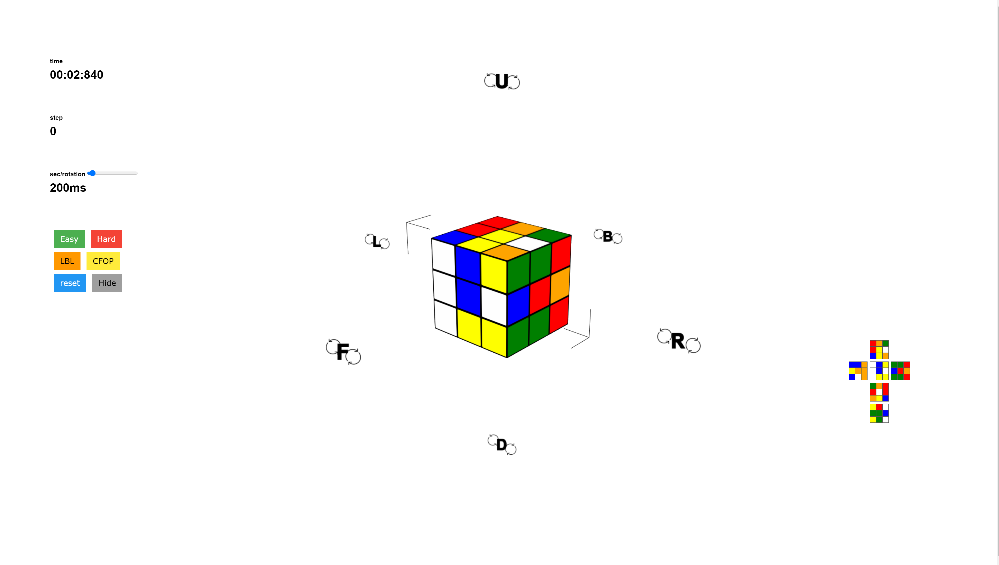
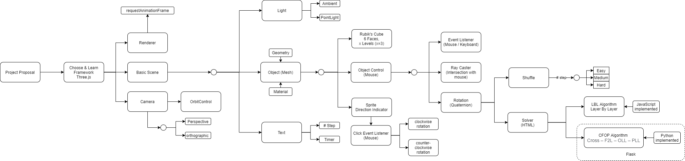

# WebGL Rubik's Cube based on Three.js
This project implements a WebGL Rubik's Cube based on Three.js.

##### Run
run ```python app.py``` to start Flask and use '127.0.0.1:5000' to view the website.

##### The implementation progress:
- [x] **[Step 1](https://github.com/ping-sun/rubiks/blob/master/step1.html): Basic 3D Scene with simple objects.**
- [x] v[Step 2](https://github.com/ping-sun/rubiks/blob/master/step2.html): Basic 3-Level Rubik's Cube. **
- [x] **[Step 3](https://github.com/ping-sun/rubiks/blob/master/step3.html): Orbit Control to support moving view points. **
- [x] **[Step 4](https://github.com/ping-sun/rubiks/blob/master/step4.html): Cube rotation on mouse event.**
- [x] **[Step 5](https://github.com/ping-sun/rubiks/blob/master/step5.html): Cube Shuffling. **
- [x] **[Step 5](https://github.com/ping-sun/rubiks/blob/master/step5.html): Layer-By-Layer(LBL) solver for the Rubik's Cube.**
- [x] **[Step 6](https://github.com/ping-sun/rubiks/blob/master/step6.html): More efficient algorithm: CFOP implemented in Python.**
- [x] **[Step 6](https://github.com/ping-sun/rubiks/blob/master/step6.html): Communication between Python and HTML via Flask.**
- [x] **[Step 7](https://github.com/ping-sun/rubiks/blob/master/step7.html): Timer and Step Counter.**
- [x] **[Step 7](https://github.com/ping-sun/rubiks/blob/master/step7.html): Direction Indicator**
- [x] **[Step 7](https://github.com/ping-sun/rubiks/blob/master/step7.html): 2D serialization**
- [x] **[Completed](https://github.com/ping-sun/rubiks/blob/master/index.html): Complete Version**

##### Screenshot



##### Tech Stacks & RoadMap:


##### Useful links for WebGL & Three.js:
* [Threejs](https://threejs.org/)
* [Discover Threejs](https://old.discoverthreejs.com/book/first-steps/first-scene/)
